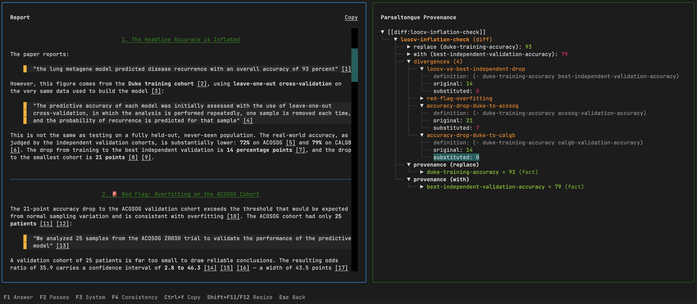
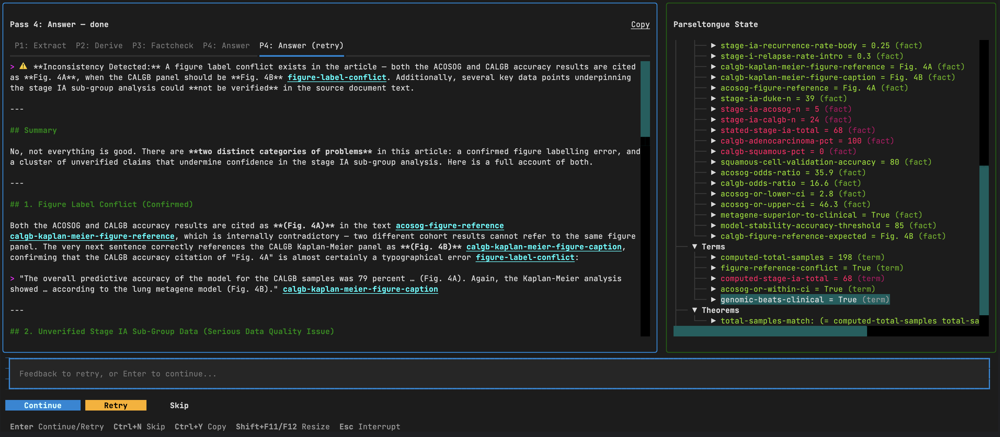
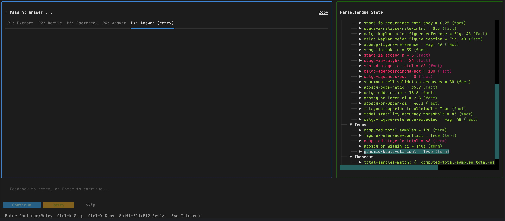
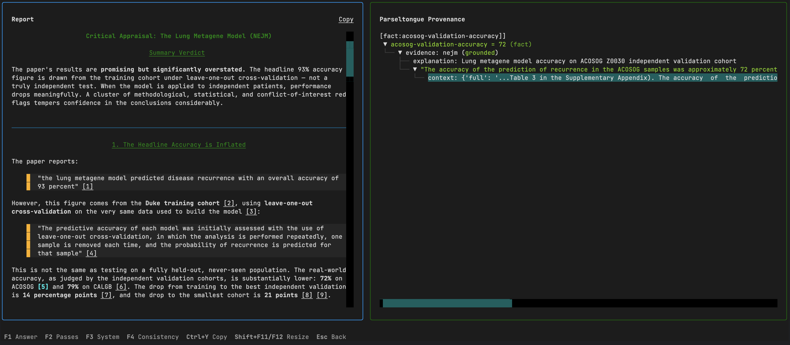
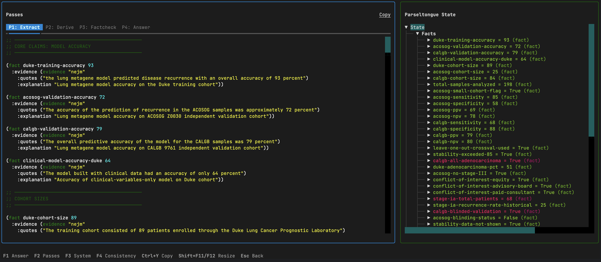
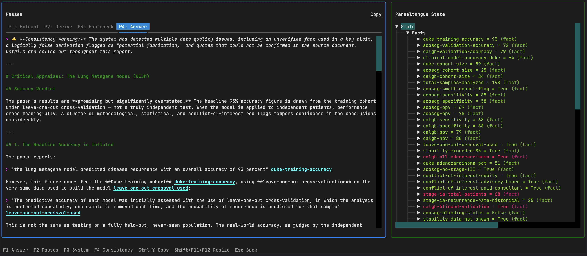
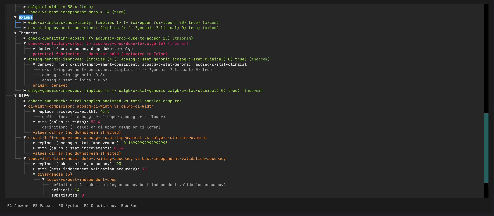
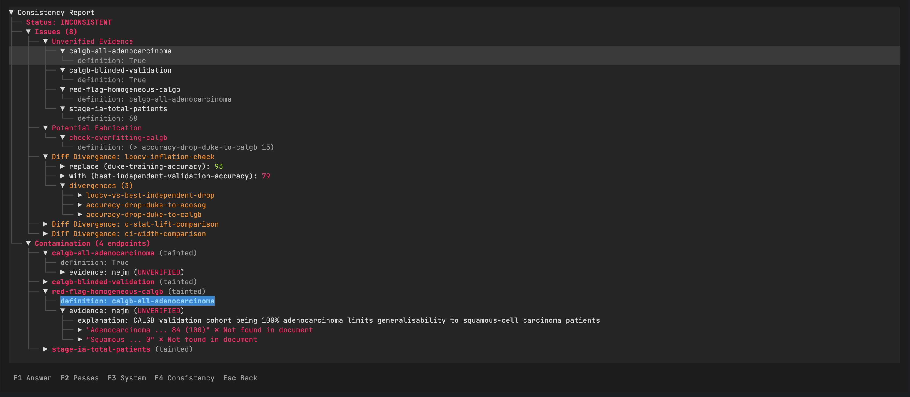
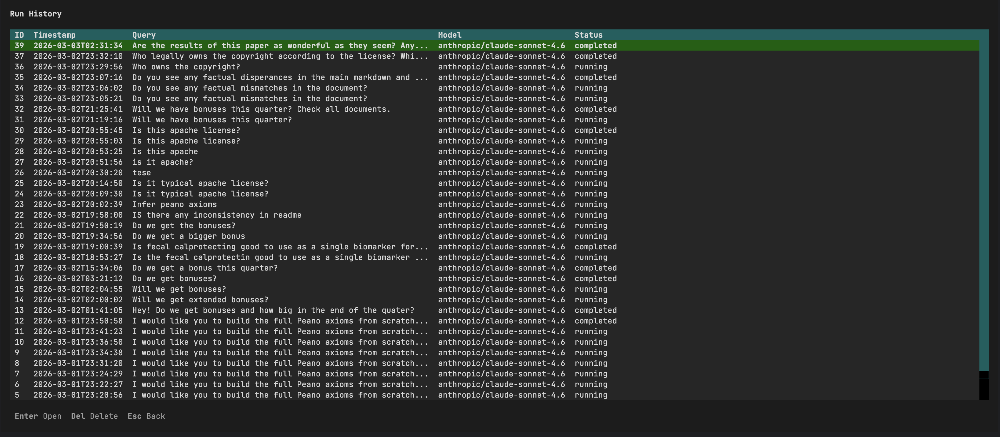

# Parseltongue CLI

Terminal interface for running the [LLM pipeline](../llm/README.md) — includes a full TUI with live pass execution, document browser, history, and result exploration.



## Installation

```bash
pip install parseltongue-dsl[cli]
```

This pulls in the LLM pipeline, [Textual](https://textual.textualize.io/) for the TUI, [Typer](https://typer.tiangolo.com/) for the CLI, and [Docling](https://ds4sd.github.io/docling/) for document conversion.

## Getting Started

Run `parseltongue` with no arguments to launch the interactive TUI:

```bash
parseltongue
```

On first launch, a configuration wizard asks for your API endpoint, key, and default model. Config is saved to `~/.parseltongue/cli/config.toml` (permissions `0600`).

## Commands

### `parseltongue` (default)

Launches the standalone TUI — main menu with options for new run, history, and configuration.

### `parseltongue start`

Explicit alias for launching the TUI.

```bash
parseltongue start -v  # verbose logging
```

### `parseltongue run`

Run the pipeline directly on documents:

```bash
parseltongue run \
  -d "Q3 Report:q3_report.pdf" \
  -d "Targets:targets_memo.txt" \
  -q "Did we beat the growth target?" \
  --model anthropic/claude-sonnet-4.6
```

| Flag | Description |
|---|---|
| `-d`, `--document` | Document to ingest. Format: `"name:path"` or just `"path"` (name defaults to filename stem) |
| `-q`, `--query` | The question to answer |
| `-m`, `--model` | LLM model (overrides config) |
| `--base-url` | API base URL (overrides config) |
| `--api-key` | API key (overrides config) |
| `--reasoning` / `--no-reasoning` | Enable/disable extended thinking |
| `--reasoning-tokens` | Thinking budget (token count) |
| `--no-tui` | Print output to stdout instead of launching TUI |
| `-v`, `--verbose` | Debug logging |

### `parseltongue inspect`

Preview document conversion without running the pipeline:

```bash
parseltongue inspect report.pdf
```

### `parseltongue configure`

Re-run the configuration wizard:

```bash
parseltongue configure
```

### `parseltongue history`

Browse and manage past runs:

```bash
parseltongue history          # list recent runs
parseltongue history show 42  # re-open run #42 in TUI
parseltongue history show 42 --no-tui  # dump to stdout
parseltongue history clear    # delete all history
```

## TUI

### Live Pipeline

CLI Pipeline ends with the LLM answer markdown and fully built system with checked evidence.




When a pipeline runs, the screen splits into two resizable panels. The left panel holds a tabbed log — each pass gets its own tab with syntax-highlighted DSL output, and retries appear as additional tabs. The right panel shows the formal system state as a live tree, rebuilt after every pass.



You can type feedback into the input field at the bottom and press Enter to retry the current pass with that guidance. Press Enter with no feedback to advance to the next pass. Ctrl+N skips the current pass entirely, and Esc interrupts a running pass. Ctrl+Y copies the active tab's log to the clipboard. Shift+F11/F12 resizes the panels.


Pass 3 (Factcheck) is optional — the TUI prompts before running it.

### Answer



The answer screen shows the grounded markdown report on the left and a provenance tree on the right. Every `[[type:name]]` reference in the report is rendered as a clickable footnote — clicking one highlights the corresponding entry in the provenance tree, letting you trace any claim back to its source quotes and derivation chain.

### Passes



A tabbed view of all four pass outputs. Switching tabs updates the system state tree on the right to show the system as it was after that pass — so you can see how the formal system grew incrementally.




### System State



The full formal system as an expandable tree: facts, terms, axioms, theorems, and diffs, each with their evidence, definitions, and verification status. Color-coded: green for grounded, yellow for divergent diffs, dim for unverified.

### Consistency



The consistency report rendered as a tree. Issues are grouped by type — unverified evidence, potential fabrications, diff divergences, and value divergences. Each diff node expands to show the two values being compared and which downstream terms diverge.

### History



A table of past pipeline runs showing timestamp, query, model, and status. Select a run to re-open its cached results in the TUI. If the consistency report has changed since the run was saved (e.g., a source document was modified), a side-by-side diff alert lets you choose between the cached and current report.

## Document Formats

Plain text formats are read directly:
- Text: `.txt`, `.md`, `.rst`, `.org`
- Data: `.csv`, `.tsv`, `.json`, `.yaml`, `.toml`, `.xml`
- Code: `.py`, `.js`, `.ts`, `.java`, `.go`, `.rs`, `.c`, `.cpp`, and many more
- Common names: `LICENSE`, `README`, `Makefile`, `Dockerfile`, etc.

Rich document formats are converted via [Docling](https://ds4sd.github.io/docling/):
- PDF, DOCX, PPTX, XLSX, HTML, and other formats Docling supports

## Configuration

Config file: `~/.parseltongue/cli/config.toml`

```toml
[provider]
base_url = "https://openrouter.ai/api/v1"
api_key = "sk-..."
model = "anthropic/claude-sonnet-4.6"

[reasoning]
enabled = false
```

The provider uses the OpenAI API format — any compatible endpoint works (OpenRouter, OpenAI, Azure, local servers like vLLM or Ollama). Just set `base_url` to your endpoint.

All config values can be overridden per-run via CLI flags.
